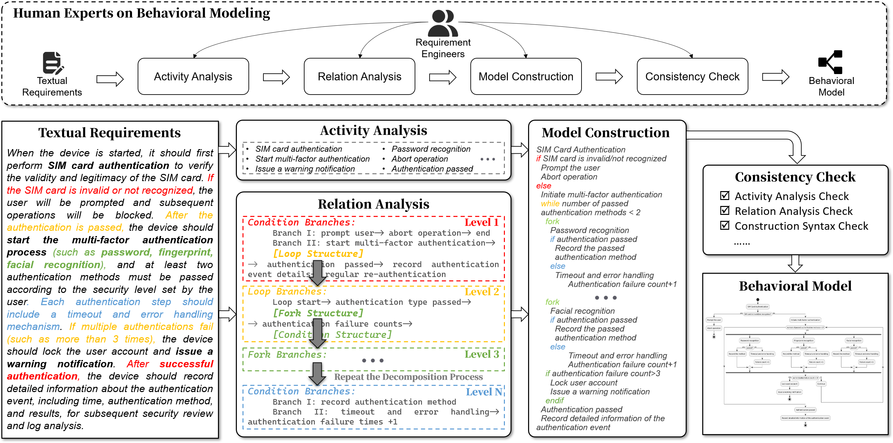
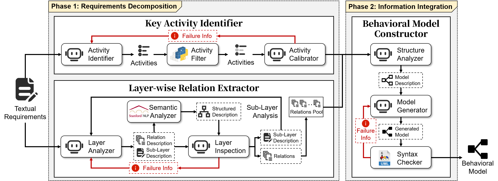
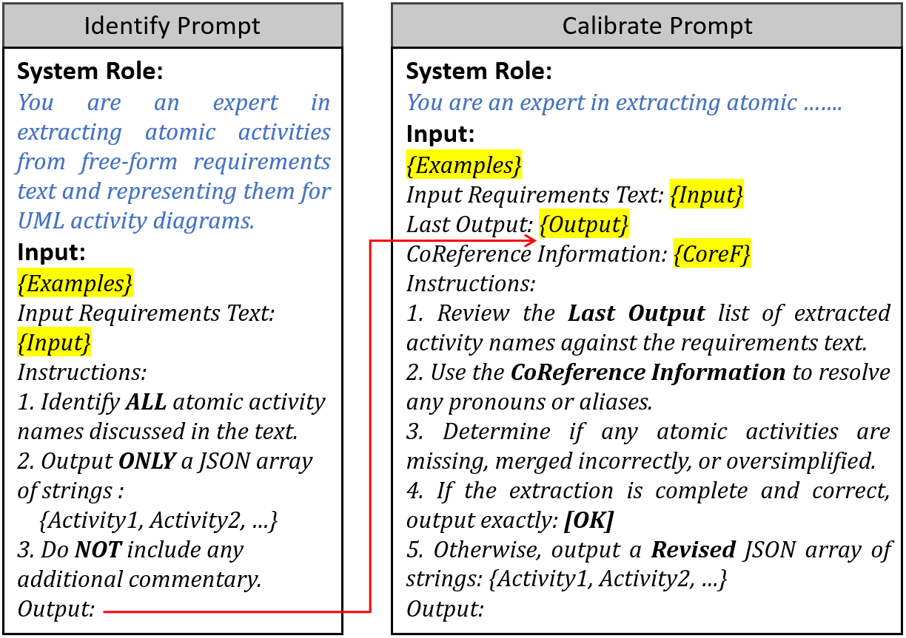
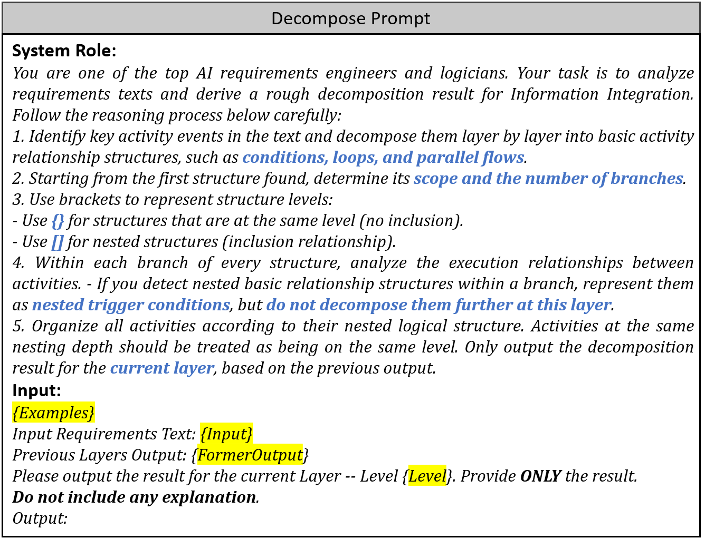
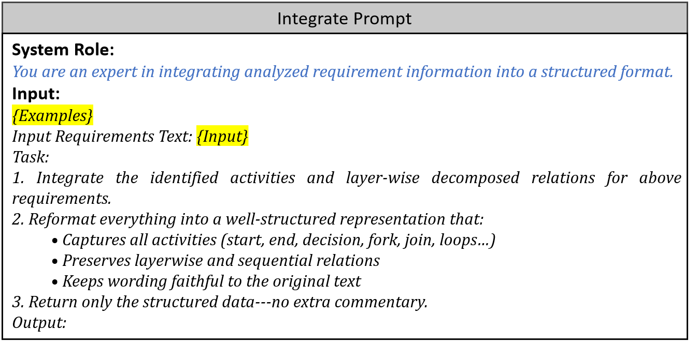
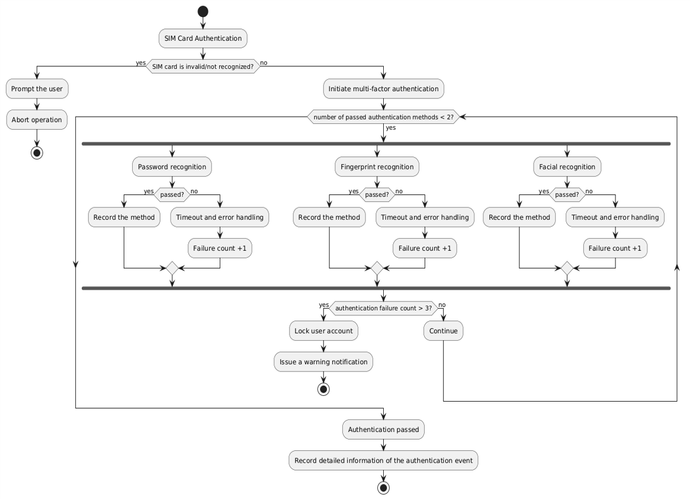
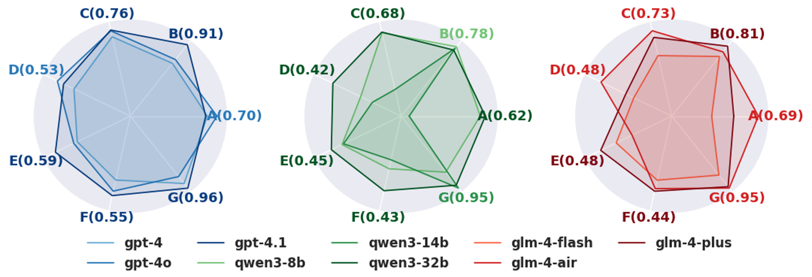

# ICSE2026_Submission

This is an anonymous artifact repository used for ICSE 2026

## Title: Modeling Like Peeling an Onion: Layerwise Analysis-Driven Automatic Behavioral Model Generation

  
  
<em>Figure 1. Motivation</em>

### Abstract
As software complexity skyrockets and requirements evolve at breakneck speed, traditional human-centric behavioral modeling can no longer keep pace in terms of efficiency, accuracy, and scalability. While existing automated approaches can produce models, they still struggle with deep semantic understanding of textual requirements or with reasoning about intricate system logic, especially nested relationships. Inspired by the way seasoned analysts “peel back” layers of a problem, we propose LATO, a Layerwise Analysis-driven auTomatic behavioral mOdeling approach. It employs a progressive decomposition strategy to guide large language models in incrementally parsing requirement structures, deconstructing behavioral dependencies, and ultimately generating executable UML activity diagrams. Comprehensive evaluations on four open‑source datasets and two real‑world industrial systems show that LATO comprehensively outperforms state-of-the-art baselines in accuracy, completeness, and syntactic compliance: _F₁_ scores for behavioral node-extraction improve by up to 71.1 %, relation-extraction _F₁_ by 52.4 % relatively, and syntactic pass rates remain above 96.7 %. The framework also exhibits strong robustness to input perturbations, confirming its cross-domain generalizability. This paper is the first to tightly fuse human-inspired strategies with LLMs in behavior modeling, yielding an intelligent infrastructure that exhibits expert-level logical understanding and generalization. By closing the modeling-skills gap, LATO delivers a next-generation, low-cost, and explainable solution for requirements engineering and AI-native software development.

### Dataset
We conduct experiments on six datasets, with their statistics summarized as follows:
- **Functional Scenario Descriptions (FSD)** comprises 116 natural language descriptions from embedded systems, encompassing deeply nested functional behaviors such as device control, data processing, and fault handling.
- **Real Automotive Case (RAC)** contains 20 requirement scenarios from the automotive domain, representing typical control logic and communication processes.
- **PURE Dataset (PURE)** [\[Public Requirements Documents\]](https://zenodo.org/records/1414117) consists of 79 documents across multiple application domains and formats.
- **Business Process Dataset (BP)** [\[bussiness-process\]](https://github.com/lwx142857/bussiness-process) includes 30 examples of business software requirements, covering a range of operational scenarios.
- **User Stories Dataset (US)** [\[Requirements data sets (user stories)\]](https://zenodo.org/records/13880060) comprises 22 sets of user stories collected from various open-source projects, reflecting typical agile requirements.
- **LM Challenges (LMC)** [\[The Ten Lockheed Martin Cyber-Physical Challenges\]](https://github.com/hbourbouh/lm_challenges) features 10 requirements documents from the cyber-physical systems domain.

### Approach

  
  
<em>Figure 2. Overview</em>

  
  
  

<em>Figure 3–5. Step Prompt Template for LATO</em>

### Generated Result Example

  
  
<em>Figure 6. Generated Result by LATO</em>

Also, you can find detailed prompt examples we crafted in [Examples Used in Prompting](./examples_in_prompt.md)

### Tools Requirements
- PlantUML: plantuml-1.2025.4.jar
- StanfordNLP: CoreNLP 4.5.10
- FastCoref: fastcoref 2.1.6
- en_core_web_sm-3.8.0.tar

### Experimental Results

  
  #### Table I. Average Performance Scores on Behavioral Node and Relation Extraction for Each Method

<table border="1" cellspacing="0" cellpadding="6" style="border-collapse: collapse; text-align: center;">
  <tr>
    <th rowspan="2">Dataset</th>
    <th rowspan="2">Metric</th>
    <th colspan="4">Node</th>
    <th rowspan="2">Gain%</th>
    <th colspan="4">Relation</th>
    <th rowspan="2">Gain%</th>
  </tr>
  <tr>
    <th>Zero-shot</th><th>Few-shot</th><th>CoT</th><th><b>LATO</b></th>
    <th>Zero-shot</th><th>Few-shot</th><th>CoT</th><th><b>LATO</b></th>
  </tr>

  <!-- FSD -->
  <tr>
    <td rowspan="3"><b>FSD</b></td>
    <td><b>Precision</b></td>
    <td>0.6821</td><td>0.7540</td><td>0.7913</td><td><b>0.8654</b></td>
    <td rowspan="3" style="font-weight:bold; color:green;">+10.3%</td>
    <td>0.6606</td><td>0.6544</td><td>0.5651</td><td><b>0.7111</b></td>
    <td rowspan="3" style="font-weight:bold; color:green;">+20.0%</td>
  </tr>
  <tr>
    <td><b>Recall</b></td>
    <td>0.5932</td><td>0.7107</td><td>0.7481</td><td><b>0.8322</b></td>
    <td>0.3711</td><td>0.4124</td><td>0.4420</td><td><b>0.5296</b></td>
  </tr>
  <tr>
    <td><b>F₁</b></td>
    <td>0.6348</td><td>0.7318</td><td>0.7692</td><td><b>0.8484</b></td>
    <td>0.4752</td><td>0.5059</td><td>0.4960</td><td><b>0.6071</b></td>
  </tr>

  <!-- RAC -->
  <tr>
    <td rowspan="3"><b>RAC</b></td>
    <td><b>Precision</b></td>
    <td>0.6939</td><td>0.7500</td><td>0.6877</td><td><b>0.6905</b></td>
    <td rowspan="3" style="font-weight:bold; color:red;">−1.4%</td>
    <td>0.4419</td><td>0.4713</td><td>0.3777</td><td><b>0.5008</b></td>
    <td rowspan="3" style="font-weight:bold; color:green;">+19.7%</td>
  </tr>
  <tr>
    <td><b>Recall</b></td>
    <td>0.7858</td><td>0.7812</td><td>0.7904</td><td><b>0.8320</b></td>
    <td>0.3953</td><td>0.3853</td><td>0.3568</td><td><b>0.5142</b></td>
  </tr>
  <tr>
    <td><b>F₁</b></td>
    <td>0.7370</td><td>0.7653</td><td>0.7355</td><td><b>0.7547</b></td>
    <td>0.4173</td><td>0.4240</td><td>0.3669</td><td><b>0.5074</b></td>
  </tr>

  <!-- PURE -->
  <tr>
    <td rowspan="3"><b>PURE</b></td>
    <td><b>Precision</b></td>
    <td>0.7430</td><td>0.7925</td><td>0.8147</td><td><b>0.8891</b></td>
    <td rowspan="3" style="font-weight:bold; color:green;">+9.3%</td>
    <td>0.5095</td><td>0.5910</td><td>0.4568</td><td><b>0.6341</b></td>
    <td rowspan="3" style="font-weight:bold; color:green;">+8.3%</td>
  </tr>
  <tr>
    <td><b>Recall</b></td>
    <td>0.6654</td><td>0.7586</td><td>0.7852</td><td><b>0.8597</b></td>
    <td>0.4524</td><td>0.5107</td><td>0.5031</td><td><b>0.5570</b></td>
  </tr>
  <tr>
    <td><b>F₁</b></td>
    <td>0.7023</td><td>0.7752</td><td>0.7998</td><td><b>0.8742</b></td>
    <td>0.4793</td><td>0.5479</td><td>0.4788</td><td><b>0.5931</b></td>
  </tr>

  <!-- BP -->
  <tr>
    <td rowspan="3"><b>BP</b></td>
    <td><b>Precision</b></td>
    <td>0.6538</td><td>0.6717</td><td>0.5341</td><td><b>0.6515</b></td>
    <td rowspan="3" style="font-weight:bold; color:green;">+15.0%</td>
    <td>0.4043</td><td>0.4586</td><td>0.3156</td><td><b>0.4523</b></td>
    <td rowspan="3" style="font-weight:bold; color:green;">+18.5%</td>
  </tr>
  <tr>
    <td><b>Recall</b></td>
    <td>0.3479</td><td>0.4008</td><td>0.4536</td><td><b>0.5180</b></td>
    <td>0.2129</td><td>0.2717</td><td>0.2661</td><td><b>0.3655</b></td>
  </tr>
  <tr>
    <td><b>F₁</b></td>
    <td>0.4542</td><td>0.5020</td><td>0.4906</td><td><b>0.5772</b></td>
    <td>0.2789</td><td>0.3412</td><td>0.2888</td><td><b>0.4043</b></td>
  </tr>

  <!-- US -->
  <tr>
    <td rowspan="3"><b>US</b></td>
    <td><b>Precision</b></td>
    <td>0.2210</td><td>0.2541</td><td>0.1214</td><td><b>0.5265</b></td>
    <td rowspan="3" style="font-weight:bold; color:green;">+71.1%</td>
    <td>0.2914</td><td>0.3186</td><td>0.1629</td><td><b>0.5969</b></td>
    <td rowspan="3" style="font-weight:bold; color:green;">+52.4%</td>
  </tr>
  <tr>
    <td><b>Recall</b></td>
    <td>0.6498</td><td>0.6756</td><td>0.6327</td><td><b>0.7895</b></td>
    <td>0.9700</td><td>0.9543</td><td>0.9180</td><td><b>0.9329</b></td>
  </tr>
  <tr>
    <td><b>F₁</b></td>
    <td>0.3299</td><td>0.3693</td><td>0.2037</td><td><b>0.6317</b></td>
    <td>0.4482</td><td>0.4777</td><td>0.2802</td><td><b>0.7280</b></td>
  </tr>

  <!-- LMC -->
  <tr>
    <td rowspan="3"><b>LMC</b></td>
    <td><b>Precision</b></td>
    <td>0.5095</td><td>0.5910</td><td>0.4568</td><td><b>0.6341</b></td>
    <td rowspan="3" style="font-weight:bold; color:green;">+8.3%</td>
    <td>0.8093</td><td>0.8574</td><td>0.7474</td><td><b>0.8598</b></td>
    <td rowspan="3" style="font-weight:bold; color:green;">+1.5%</td>
  </tr>
  <tr>
    <td><b>Recall</b></td>
    <td>0.4524</td><td>0.5107</td><td>0.5031</td><td><b>0.5570</b></td>
    <td>0.6830</td><td>0.7108</td><td>0.8048</td><td><b>0.7293</b></td>
  </tr>
  <tr>
    <td><b>F₁</b></td>
    <td>0.4793</td><td>0.5479</td><td>0.4788</td><td><b>0.5931</b></td>
    <td>0.7408</td><td>0.7773</td><td>0.7750</td><td><b>0.7892</b></td>
  </tr>
</table>

#### Table II. Average Pass Rate for Each Method

| Dataset | Zero-shot | Few-shot | CoT    | **LATO** |
|:-------:|:---------:|:--------:|:------:|:----------:|
| FSD     |   0.8261  |  0.9429  | 0.9321 | **0.9679** |
| RAC     |   0.9672  |  0.9545  | 0.9560 | **0.9708** |
| PURE    |   0.9464  |  0.9757  | 0.9479 | **0.9764** |
| BP      |   0.9730  |  0.8964  | 0.9864 | **0.9667** |
| US      |   0.9814  |  0.9506  | 0.9257 | **0.9914** |
| LMC     |   0.9879  |  0.9750  | 0.9743 | **0.9936** |

#### Table III. The Performance Score of LATO with Different Base Models

| LLM             | N‑Precision | N‑Recall | N‑F₁  | R‑Precision | R‑Recall | R‑F₁  | Pass Rate |
|:---------------:|:-----------:|:--------:|:-----:|:-----------:|:--------:|:-----:|:---------:|
| `gpt-4`         | 0.6584      | 0.8136   | 0.7278| 0.4815      | 0.5226   | 0.5012| 0.9172    |
| `gpt-4o`        | **0.6961**  | 0.8259   |0.7555 | **0.5319**  | 0.5310   |0.5314 | 0.8826    |
| `gpt-4.1`       | 0.6534      |**0.9091**|**0.7603**|0.5101    |**0.5896**|**0.5470**|**0.9587**|
| `qwen3-8b`      | 0.6007      | 0.7812   | 0.6792| 0.3467      | 0.4198   | 0.3797| 0.8574    |
| `qwen3-14b`     | 0.4075      | 0.7704   | 0.5330| 0.3186      | 0.4160   | 0.3608| 0.9482|
| `qwen3-32b`     | 0.6204      | 0.7581   |0.6824 | 0.4172      |0.4515    |0.4337|0.9206   |
| `glm-4-flash`   | 0.5719      | 0.7535   | 0.6503| 0.3922      | 0.4389   | 0.4142| 0.8734    |
| `glm-4-air`     | 0.6943      | 0.7735   |0.7318 |0.4771       |0.4020    | 0.4364|0.9548|
| `glm-4-plus`    | 0.6181      |0.8105    | 0.7013| 0.4105      |0.4841    |0.4443 |0.9392   |

 

  
  
<em>Figure 7. Performance comparison of LATO with different base models. Indicators A–G correspond to the Precision, Recall, and F1 score for both nodes and relations, along with the overall Pass Rate. The value in brackets indicates the highest score achieved in the current comparison.</em>

  
#### Table IV. The Performance Scores of LATO with Different Example Seeds

| Seed   | N‑Precision | N‑Recall | N‑F₁  |         | R‑Precision | R‑Recall | R‑F₁  |         | Pass Rate |        |
|:------:|:-----------:|:--------:|:-----:|:-------:|:-----------:|:--------:|:-----:|:-------:|:---------:|:------:|
| Seed A | 0.6905      | 0.8320   | 0.7547| --      | 0.5008      | 0.5142   | 0.5074| --      | 0.9708    | --     |
| Seed B | 0.6840      | 0.8255   | 0.7492| _0.73 %↓_| 0.4821      | 0.5010   | 0.4898| _3.47 %↓_| 0.9676    | _0.33 %↓_ |
| Seed C | 0.6702      | 0.8123   | 0.7350| _2.61 %↓_| 0.4955      | 0.5108   | 0.5035| _0.77 %↓_| 0.9690    | _0.18 %↓_ |

#### Table V. The Results of Ablation Study

| Configuration            | N‑Precision | N‑Recall | N‑F₁  |         | R‑Precision | R‑Recall | R‑F₁  |         | Pass Rate |        |
|:------------------------:|:-----------:|:--------:|:-----:|:-------:|:-----------:|:--------:|:-----:|:-------:|:---------:|:------:|
| **LATO**               | 0.6905      | 0.8320   | 0.7547| --      | 0.5008      | 0.5142   | 0.5074| --      | 0.9708    | --     |
| _w/o Identifier_         | 0.6356      | 0.7257   | 0.6777| _10.20 %↓_| 0.4178      | 0.4003   | 0.4089| _19.41 %↓_| 0.9614    | _0.97 %↓_ |
| _w/o Extractor_          | 0.6232      | 0.7288   | 0.6719| _10.97 %↓_| 0.3919      | 0.3886   | 0.3902| _23.10 %↓_| 0.9592    | _1.19 %↓_ |
| _w/o Constructor_        | 0.6019      | 0.6687   | 0.6336| _16.05 %↓_| 0.3519      | 0.3283   | 0.3397| _33.06 %↓_| 0.9316    | _4.04 %↓_ |

#### Table VI. Budget/Latency of Different LLMs
| Model        | Input ($ per 1M tokens) | Output ($ per 1M tokens) | Avg. Response (s) |
|--------------|-----------------------|------------------------|-------------------|
| gpt-4        | 30.00                 | 60.00                  | 283.00            |
| gpt-4.1      | 2.00                  | 8.00                   | 101.00            |
| gpt-4o       | 2.50                  | 10.00                  | 94.00             |
| qwen3-8b     | 0.18                  | 0.70                   | 96.00             |
| qwen3-14b    | 0.35                  | 1.40                   | 228.00            |
| qwen3-32b    | 0.16                  | 0.64                   | 137.00            |
| glm-4-flash  | 0.00                  | 0.00                   | 175.00            |
| glm-4-air    | 0.07                  | 0.28                   | 87.00             |
| glm-4-plus   | 0.70                  | 2.80                   | 296.00            |
| deepseek-v3  | 0.28                  | 0.42                   | 168.00            |

